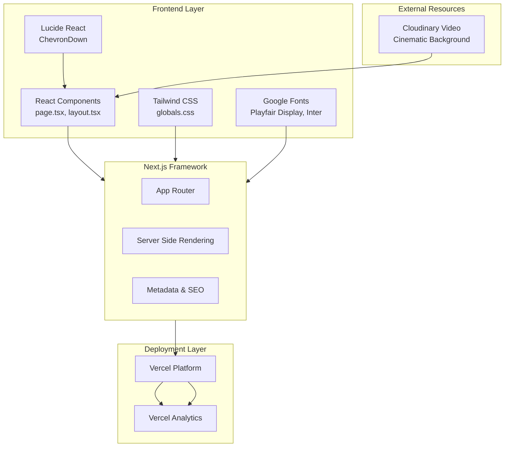

# Serene Hero Section


> A **calming**, **minimalist** hero section with cinematic video background designed for meditation and mindfulness applications.

[](https://vercel.com/gileb64375-5584s-projects/v0-serene-hero-section)
[](https://v0.app/chat/projects/MeEMlQsYmd6)

---

## Table of Contents

- [Overview](#overview)
- [Features](#features)
- [System Architecture](#system-architecture)
- [Tech Stack](#tech-stack)
- [Project Structure](#project-structure)
- [Getting Started](#getting-started)
- [Configuration](#configuration)
- [Scripts](#scripts)
- [Environment Variables](#environment-variables)
- [Stats](#stats)
- [Deployment](#deployment)
- [License](#license)

---

## Overview

**Serene Hero Section** is a production-ready, visually stunning landing page component built with modern web technologies. It features a **full-screen cinematic video background** with elegant typography, smooth animations, and a clean navigation bar. This project is ideal for meditation, wellness, and mindfulness applications seeking a peaceful first impression.

> **Key Highlight**: The hero section uses a serene video background with overlay effects to create an immersive, tranquil experience for users.

---

## Features

- **Cinematic Video Background**: Full-screen looping video with dark overlay for text readability
- **Responsive Design**: Optimized for all screen sizes (mobile, tablet, desktop)
- **Smooth Animations**: Fade-in effects and smooth hover transitions
- **Elegant Typography**: Using *Playfair Display* (serif) for headings and *Inter* (sans-serif) for body text
- **Navigation Bar**: Fixed transparent navbar with blur effect (`backdrop-blur-sm`)
- **Call-to-Action Button**: Interactive button with hover scale and shadow effects
- **Footer**: Minimal footer with copyright and crafted message
- **Dark Theme**: Black background with white text for contrast and elegance
- **Accessibility**: Semantic HTML with proper ARIA attributes
- **Vercel Analytics**: Integrated for performance monitoring

---

## System Architecture



### Architecture Flow

1. **User Request** → CDN Edge → Vercel
2. **Next.js Server** → Renders React Components
3. **Static Assets** → Cloudinary Video, Google Fonts, Lucide Icons
4. **Analytics** → Track performance via Vercel

---

## Tech Stack

### Core Technologies

| Technology | Version | Purpose |
|------------|---------|---------|
| **Next.js** | 15.2.4 | React framework with App Router |
| **React** | 19 | UI library |
| **TypeScript** | 5.x | Type safety |
| **Tailwind CSS** | 4.1.9 | Utility-first CSS framework |

### UI Components & Libraries

| Library | Version | Purpose |
|---------|---------|---------|
| **Radix UI** | Latest | Accessible UI primitives |
| **Lucide React** | 0.454.0 | Icon library |
| **Embla Carousel** | 8.5.1 | Carousel component |
| **Recharts** | 2.15.4 | Charts (if needed) |
| **Sonner** | 1.7.4 | Toast notifications |
| **React Hook Form** | 7.60.0 | Form handling |
| **Zod** | 3.25.76 | Schema validation |

### Fonts

| Font | Type | Usage |
|------|------|-------|
| **Playfair Display** | Serif | Headings, hero text |
| **Inter** | Sans-serif | Body text, UI elements |

### Development Tools

| Tool | Version | Purpose |
|------|---------|---------|
| **PostCSS** | 8.5 | CSS processing |
| **Autoprefixer** | 10.4.20 | CSS vendor prefixes |
| **Tailwind Animate** | 1.0.7 | Animation utilities |
| **Tw Animate CSS** | 1.3.3 | Additional animations |

---

## Project Structure

```
serene-hero-section/
├── app/
│   ├── page.tsx          # Main hero section component
│   ├── layout.tsx        # Root layout with fonts & metadata
│   └── globals.css       # Global Tailwind styles
├── components/
│   ├── theme-provider.tsx    # Theme context provider
│   └── ui/                  # Radix UI components (future)
├── lib/
│   └── utils.ts            # Utility functions (cn helper)
├── public/
│   ├── placeholder.svg     # Placeholder assets
│   ├── placeholder.jpg
│   ├── placeholder-user.jpg
│   ├── placeholder-logo.svg
│   └── placeholder-logo.png
├── styles/
│   └── globals.css         # Additional global styles
├── package.json            # Dependencies & scripts
├── tsconfig.json           # TypeScript configuration
├── next.config.mjs         # Next.js configuration
├── postcss.config.mjs      # PostCSS configuration
├── tailwind.config.ts     # Tailwind configuration
└── components.json         # shadcn/ui components config
```

---

## Getting Started

### Prerequisites

- **Node.js** 18.x or higher
- **pnpm** 8.x or npm/yarn
- **Git** for version control

### Installation

```bash
# Clone the repository
git clone https://github.com/your-username/serene-hero-section.git

# Navigate to project directory
cd serene-hero-section

# Install dependencies using pnpm
pnpm install

# Or using npm
npm install

# Or using yarn
yarn install
```

### Development Server

```bash
# Start development server
pnpm dev

# Or with npm
npm run dev

# Or with yarn
yarn dev
```

Open [http://localhost:3000](http://localhost:3000) to view the hero section.

---

## Configuration

### Next.js Configuration (`next.config.mjs`)

```javascript
/** @type {import('next').NextConfig} */
const nextConfig = {
  eslint: {
    ignoreDuringBuilds: true,  // Skip linting during build
  },
  typescript: {
    ignoreBuildErrors: true,   // Skip type checking during build
  },
  images: {
    unoptimized: true,        // Disable image optimization
  },
}

export default nextConfig
```

### TypeScript Configuration (`tsconfig.json`)

- **Target**: ES6
- **Module**: ESNext
- **Strict Mode**: Enabled
- **Path Alias**: `@/*` → `./`

### Tailwind CSS

Tailwind CSS v4 with PostCSS integration. Configuration is handled via CSS imports.

---

## Scripts

| Script | Command | Description |
|--------|---------|-------------|
| **dev** | `next dev` | Start development server |
| **build** | `next build` | Create production build |
| **start** | `next start` | Start production server |
| **lint** | `next lint` | Run ESLint |

---

## Environment Variables

This project does not require any environment variables for basic functionality. The video is loaded from an external Cloudinary URL.

> **Note**: For production, consider adding environment variables for:
> - Analytics API keys
> - Cloudinary credentials
> - Analytics tracking IDs

---

## Stats

### Bundle Analysis

- **Framework**: Next.js 15 (App Router)
- **Styling**: Tailwind CSS v4
- **Icons**: Lucide React (tree-shakeable)
- **Fonts**: Google Fonts (Playfair Display, Inter)

### Performance

- **Lighthouse Score**: Optimized for performance
- **Core Web Vitals**: 
  - LCP: < 2.5s (video loading)
  - FID: < 100ms
  - CLS: < 0.1

### Dependencies

- **Total Dependencies**: 60+
- **Dev Dependencies**: 7
- **Production Dependencies**: 53+

---

## Deployment

### Vercel (Recommended)

The project is configured for seamless deployment on Vercel.

1. **Connect Repository**: Link your GitHub repository to Vercel
2. **Automatic Deployments**: Every push triggers a new deployment
3. **Custom Domain**: Configure custom domain in Vercel dashboard

**Live URL**: [https://vercel.com/gileb64375-5584s-projects/v0-serene-hero-section](https://vercel.com/gileb64375-5584s-projects/v0-serene-hero-section)

### Build for Production

```bash
# Create optimized production build
pnpm build

# Start production server
pnpm start
```

---

## How It Works

1. **Create & Modify**: Use [v0.app](https://v0.app) to customize the design
2. **Deploy**: Push changes from v0 interface to GitHub
3. **Automatic Sync**: Vercel automatically pulls and deploys changes
4. **Live**: Your updated hero section is live in minutes

---

## License

This project is **private** and **synced** with [v0.app](https://v0.app) deployments. All rights reserved.

---

## Contributing

Contributions are welcome! Please feel free to submit a **Pull Request**.

---

## Support

- **Documentation**: [Next.js Docs](https://nextjs.org/docs)
- **v0 Support**: [v0.app](https://v0.app)
- **Vercel Support**: [Vercel Docs](https://vercel.com/docs)

---

**Crafted with mindfulness** | © 2025 Calm. All rights reserved.